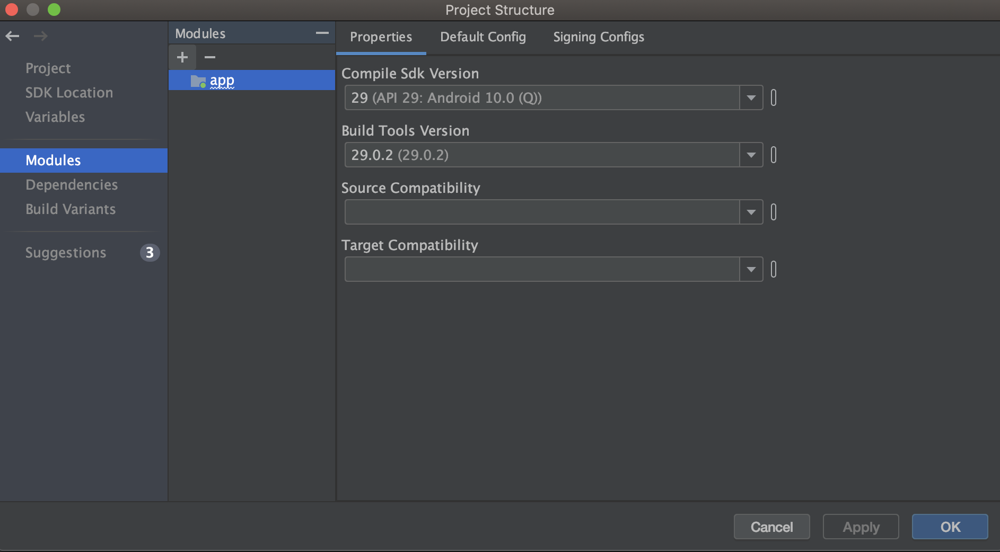
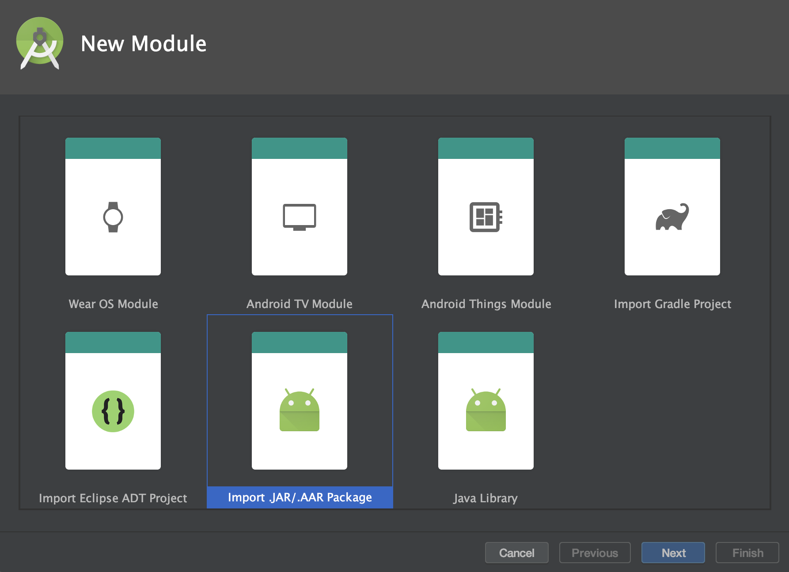
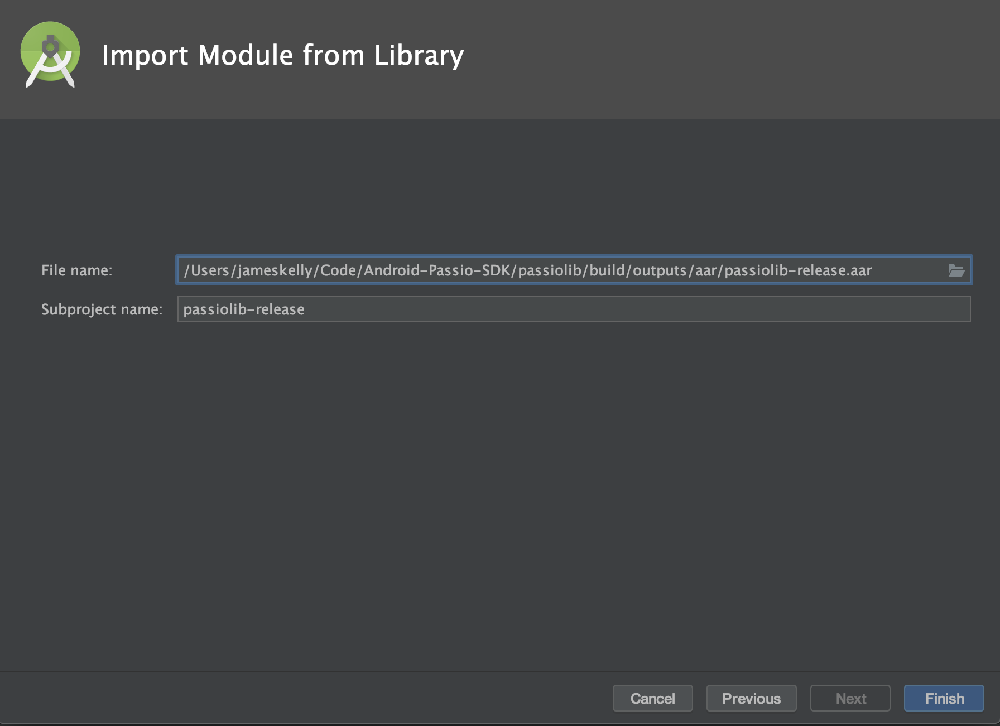

# Passio SDK

[](https://github.com/Passiolife/Passio-Nutrition-AI-Android-SDK-Distribution/releases/tag/v3.0.0)    []() [](https://developer.android.com/about/versions/oreo)  [](https://github.com/JetBrains/kotlin/releases/tag/v1.6.10) [](https://musing-gates-4e7160.netlify.app/#0)

## Overview:

Welcome to Passio Nutrition-AI Android SDK!

When integrated into your app the SDK provides you with food recognition and nutrition assistant technology. The SDK is designed to take a stream of images and output foods recognized in those images along with nutrition data related to the recognized foods.

As the developer, you have complete control of when to turn on/off the SDK and to configure the outputs which include:
- food names (e.g., Avocado toast, fruit salad, Clif bar)
- lists of related food in the hierarchy (children, siblings and parents) e.g. for milk: whole milk, soy milk, almond milk etc.  
- logos detected in the images
- lists of foods associated with the logos
- text detected on packages 
- branded foods matched to the text detected on food packages
- if nutrition labels are detected, the SDK returns nutrition associated with those labels
- UPC codes detected in the images
- nutrition information associated with the foods
- food amounts (those could be default amounts or amounts coming from our amount estimation module)

By default the SDK does not record/store any photos or videos. Instead, as the end user hovers over a food item with his/her camera phone, the SDK recognizes and identifies the food item in real time. This hovering action is only transitory/temporary while the end user is pointing the camera at a particular item and is never recorded or stored within the SDK. As the developer, you can configure the SDK to capture images or videos and store them in the main app.

## Before you continue:

1. You can download the appropriate aar from PassioSDK's [releases page](https://github.com/Passiolife/Passio-Nutrition-AI-Android-SDK-Distribution/releases).
3. Make sure you receive your developer key from Passio.

## Minimum Requirements And Dependencies

* Built with Kotlin version 1.6.10
* Minimum Android SDK version is 26
* The SDK requires access to the device's camera
* The SDK is built upon CameraX, TensorFlow and Firebase's ML Vision so these dependencies will need to be added to the project manually

## Gitbook

There is a [Gitbook documentation](https://passio.gitbook.io/nutrition-ai/guides/android-sdk-docs/getting-started) you can follow to integrate the SDK and scan your first meal. It has a detailed explanation of the SDK's API and of the structure of the Sandbox App.

## Getting Started

The PassioSDKSandbox project demonstrates how to use the built in features of this SDK. 

### Demo Project

* You can download the sandbox project from PassioSDK's release page: <https://github.com/Passiolife/Passio-Nutrition-AI-Android-SDK-Distribution/releases>
* The sandbox project is located in the PassioSDKSandbox archive. Open it and add your developer key to this line in the `MainActivity`

```kotlin
val config = PassioConfiguration(this.applicationContext, "Your license key here")
PassioSDK.instance.configure(config) { passioStatus ->
    when (passioStatus.mode) {
        PassioMode.NOT_READY -> onPassioSDKError(passioStatus.debugMessage)
        PassioMode.IS_BEING_CONFIGURED -> onPassioSDKError(passioStatus.debugMessage)
        PassioMode.FAILED_TO_CONFIGURE -> onPassioSDKError(passioStatus.debugMessage)
        PassioMode.IS_DOWNLOADING_MODELS -> onDownloadingModels()
        PassioMode.IS_READY_FOR_DETECTION -> onPassioSDKReady()
    }
}
```

* Run the PassioSDKDemo project on an Android device using Android Studio

## Adding Passio SDK into your project

### 1. Add the .AAR file to your Android project

* In Android Studio, go to File -> New -> New Module -> Import .JAR/.AAR Package.

  

  

* Specify where you downloaded the file.

  

* Also, add the dependency to the passiolib module, CameraX, Tensorflow and Firebase Vision
```
dependencies {
    ...
    // Passio AAR
    implementation project(':passiolib')

    // TensorFlow
    implementation 'org.tensorflow:tensorflow-lite:2.8.0'
    implementation 'org.tensorflow:tensorflow-lite-metadata:0.4.0'

    // CameraX
    def camerax_version = "1.3.0-alpha12"
    implementation "androidx.camera:camera-core:$camerax_version"
    implementation "androidx.camera:camera-camera2:$camerax_version"
    implementation "androidx.camera:camera-lifecycle:$camerax_version"
    implementation 'androidx.camera:camera-view:1.3.0-alpha02'
    implementation 'androidx.camera:camera-extensions:1.3.0-alpha02'

    // Barcode and OCR
    implementation 'com.google.android.gms:play-services-mlkit-text-recognition:19.0.0'
    implementation 'com.google.android.gms:play-services-mlkit-barcode-scanning:18.3.0'
    ...
}
```

### 2. Camera Permission and Preview

* The SDK requires the device's Camera to work. Acquire the user's permission to use the Camera with these steps: 
[Requesting Android permissions](https://developer.android.com/training/permissions/requesting).
* After the user grants the app the permission to use the Camera, proceed with configuring the Passio SDK.
* To enable the camera add a androidx.camera.view.PreviewView to you view hierarchy. This view will render the frames coming out of the camera manager that are meant for the preview.
* Implement the `CameraViewProvider` interface through an Activity, Fragment or a View which will server as a lifecycle owner for the camera.
* Calling the `startCamera` method starts the camera.
* Calling the `stopCamera` will stop the camera and release the lifecycle owner reference.

```kotlin
class MainActivity : AppCompatActivity(), PassioCameraViewProvider {
    ...
    override fun requestCameraLifecycleOwner(): LifecycleOwner {
        return this
    }

    override fun requestPreviewView(): PreviewView {
        return mainPreviewView
    }
    ...

    // This method is called after the permission to use the camera is granted
    private fun init() {
        PassioSDK.instance.startCamera(this)
        ...
    }

    // Stop camera
    override fun onDestroy() {
        super.onDestroyView()
        PassioSDK.instance.stopCamera()
    }
}
```

### 3. Initialize and configure the SDK

* Use the API key received from us or request a key from [support@passiolife.com](support@passiolife.com).
* Initialize and configure the SDK through the `PassioSDK.Builder` if you want the SDK to download the files or the files have already been downloaded.

```kotlin
val passioConfiguration = PassioConfiguration(
    this.applicationContext,
    "Your developer key here"
).apply {
    localFiles = /* Provide list of files URIs here*/
}
PassioSDK.instance.configure(config) { passioStatus ->
    when (passioStatus.mode) {
        PassioMode.NOT_READY -> onPassioSDKError(passioStatus.debugMessage)
        PassioMode.IS_BEING_CONFIGURED -> onPassioSDKError(passioStatus.debugMessage)
        PassioMode.FAILED_TO_CONFIGURE -> onPassioSDKError(passioStatus.debugMessage)
        PassioMode.IS_DOWNLOADING_MODELS -> onDownloadingModels()
        PassioMode.IS_READY_FOR_DETECTION -> onPassioSDKReady()
    }
}
```

* The initialization process is being executed on a background thread, so it will not block the Main thread's execution. Once the initialization process is over, the SDK will automatically start analyzing frames if the camera has been started.
* When you call the configure method of the Passio SDK with the PassioConfiguration object, you will need to define a callback to handle the result of the configuration process. This result is comprised in the PassioStatus object.

```kotlin
class PassioStatus {
    var mode: PassioMode = PassioMode.NOT_READY
    var missingFiles: List<FileName>? = null
    var debugMessage: String? = null
    var activeModels: Int? = null
}
```

The **mode** of the PassioStatus defines what is the current status of the configuration process. There are 5 different modes, and they all should be handled by the implementing side.

```kotlin
enum class PassioMode {
    NOT_READY,
    FAILED_TO_CONFIGURE,
    IS_BEING_CONFIGURED,
    IS_DOWNLOADING_MODELS,
    IS_READY_FOR_DETECTION
}
```
- NOT_READY -> The configuration process hasn't started yet.
- FAILED_TO_CONFIGURE -> There was an error during the configuration process.
- IS_BEING_CONFIGURED -> The SDK is still in the configuration process. Normally, you shouldn't receive this mode as a callback to the configure method. If you do please contact our support team.
- IS_DOWNLOADING_MODELS -> The files required by the SDK to work are not present and are currently being downloaded.
- IS_READY_FOR_DETECTION -> The configuration process is over and all the SDKs functionalities are available.

### 4. Start using the SDK

* The SDK can detect 4 different categories: FOOD, LOGO, BARCODE and OCR. The FOOD recognition is powered by Passio's neural network and is used to recognize over 3000 food classes. To scan branded food items, use either LOGO, BARCODE or OCR. LOGO can be used to recognize the symbol of a branded food. BARCODE, as the name suggests, can be used to scan a barcode of a branded food. Finally, OCR can detect the name of a branded food. To choose one or more types of detection, we define a DetectionOptions object and add the types to its detect method:


```kotlin
val detectionConfig = FoodDetectionConfiguration().apply {
    detectBarcodes = true
}
```

To start the Food Recognition process a `FoodRecognitionListener` also has to be defined. The listener serves as a callback for all the different food detection processes defined by the FoodDetectionConfiguration object. Only the corresponding candidate lists will be populated (e.g. if you define detection types FOOD and BARCODE, you will never receive a logoCandidates list in this callback).


```kotlin
private val foodListener = object : FoodRecognitionListener {
    override fun onRecognitionResults(candidates: FoodCandidates?, image: Bitmap?, nutritionFacts: PassioNutritionFacts?) {
        val visualCandidates = candidates.detectedCandidates!!
        val barcodeCandidates = candidates.barcodeCandidates!!
        if (visualCandidates.isEmpty() && barcodeCandidates.isEmpty()) {
            // No candidates were recognized
        } else if (barcodeCandidates.isNotEmpty()) {
            val bestBarcodeResult = barcodeCandidates.maxByOrNull { it.boundingBox.width() * it.boundingBox.height() } ?: return
            // Display barcode result
        } else {
            val bestVisualCandidate = visualCandidates.maxByOrNull { it.confidence } ?: return
            // Display food result
        }
    }
}
```

* Using the listener and the detection options  start the food detection by calling the `startFoodDetection` method of the SDK.

```kotlin
override fun onStart() {
    super.onStart()
    PassioSDK.instance.startFoodDetection(foodListener, detectionOptions)
}
```

* Stop the food recognition on the `onStop()` lifecycle callback.

```kotlin
override fun onStop() {
    PassioSDK.instance.stopObjectDetectionWithVoting()
    super.onStop()
}
```

### 5. Fetch nutritional data

Depending on the type of recognized candidate, nutritional data is fetched using these two methods:
* For visual candidates: ```fetchFoodItemForPassioID```
* For barcode and packaged food: ```fetchFoodItemForProductCode```

Both of these functions have a callback that returns the nutritional data as ```PassioFoodItem``` object, null if no data is found or the network is unavailable.

### 6. Search

The SDK's search functionality returns a list of search results and a list of search options of a given search term. 

```kotlin
fun searchForFood(
    term: String,
    callback: (result: List<PassioSearchResult>, searchOptions: List<String>) -> Unit
)
```

* PassioSearchResult holds information such as foodName, brandName, iconID and nutritionPreview
* The search options provide a list of alternate search terms related to the given term. For example if the search term is "apple", a list of searchOptions would include items such as "red apple", "green apple", "apple juice"...

The function ```fetchSearchResult``` is used to retrieve nutritional data for a given PassioSearchResult. Same as in the camera recognition results, the return object is ```PassioFoodItem```.

### 8. PassioFoodItem

This is top level object that holds all of the nutritional information such as nutrient data, serving sizes, data origins and more.

```kotlin
data class PassioFoodItem(
    val id: String,
    val name: String,
    val details: String,
    val iconId: String,
    val amount: PassioFoodAmount,
    val ingredients: List<PassioIngredient>,
)
```
* Details contain information such as food brand or food category for general food items
* PassioFoodAmount can be used to get a list of associated serving units and predefined serving sizes. It's also used to control the currently selected quantity and unit
* The nutritional data will be stored in the PassioIngredient object. 

```kotlin
data class PassioIngredient(
    val id: String,
    val name: String,
    val iconId: String,
    val amount: PassioFoodAmount,
    val referenceNutrients: PassioNutrients,
    val metadata: PassioFoodMetadata,
)
```
* Each ingredient has it's own nutritional data and serving size. 
* Nutrients like calories, carbs, protein and other can be found in the PassioNutrients object, but there are three helper functions to easily fetch the nutrients for the appropriate use case
* ```fun nutrients(weight: UnitMass): PassioNutrients``` will return nutrients for a given UnitMass
* ```fun nutrientsSelectedSize(): PassioNutrients``` will return nutrients for the currently selected unit and quantity in the ```amount``` object
* ```fun nutrientsReference(): PassioNutrients``` will return nutrients for the reference weight of 100 grams

## Use the image below to test recognition


## Passio Camera Fragment

* For a simple way to use the camera functionality of the SDK, extend the `PassioCameraFragment`. It contains the logic to ask for the camera permission, and if granted, start the camera preview. An example of the PassioCameraFragment can be seen in the `FoodRecognizerFragment` of the PassioSDKDemo project.

<sup>Copyright 2023 Passio Inc</sup>